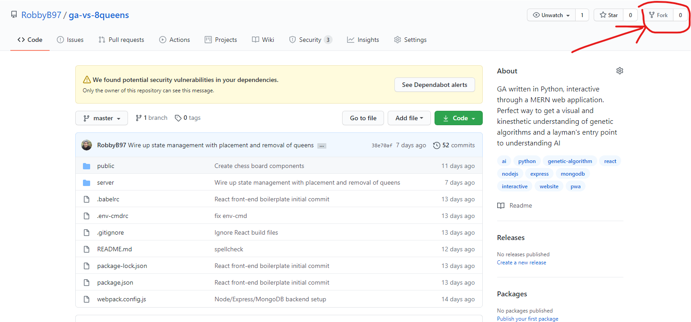
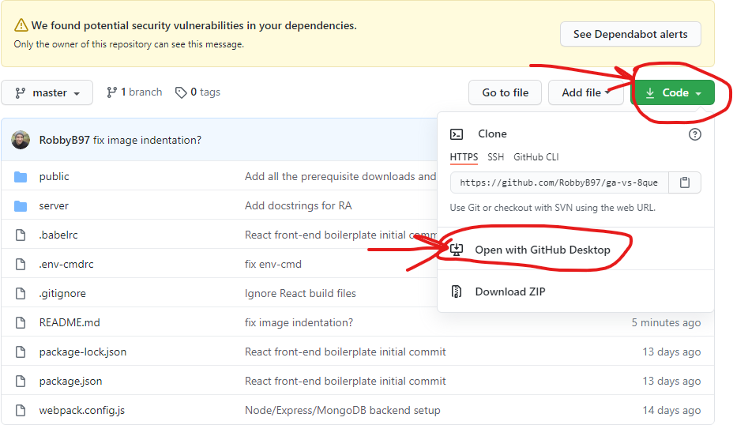
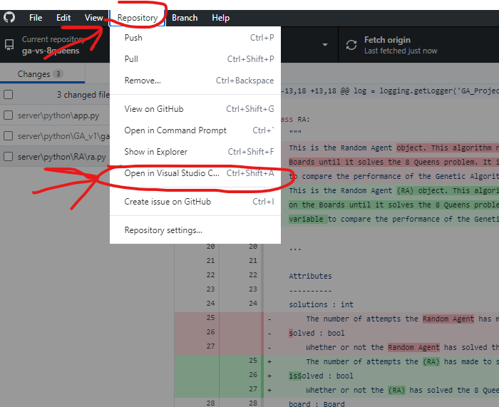
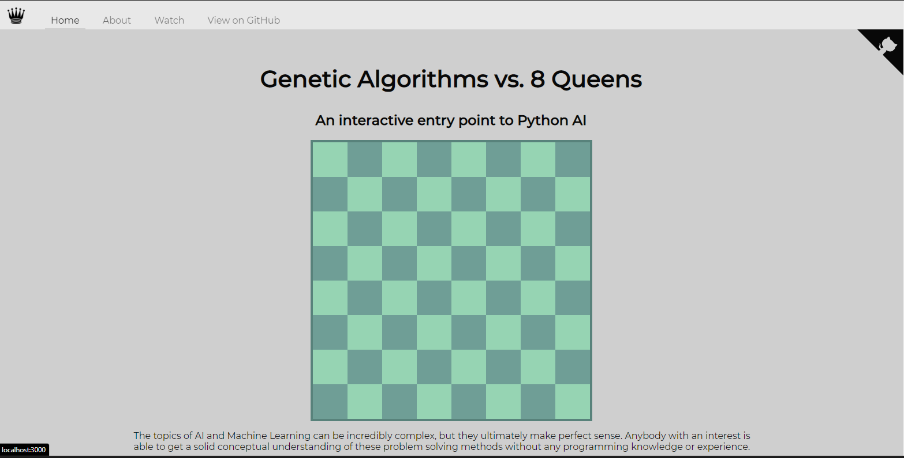

# GA Vs. 8 Queens
>   This web application is a work in progress. I am building it [live on Twitch](https://www.twitch.tv/robbybergers), and will be releasing a more condensed, entertaining and educational version of the whole development process through a YouTube video series.

---

# Mission Statement
>   This is the ultimate goal of the project. Written as though the project is already completed, so you can have a clear understanding of what I am working towards and why.

This is a web application that hosts a Genetic Algorithm built in Python, that can be interfaced with through a MERN web application. Any non-technical person that is interested in the power of AI is able to get a visual and kinesthetic understanding of the inner workings of AI algorithms through an interactive React application without getting bogged down with the semantic noise of computer science jargon and theory. 

This topic can be incredibly complex, but in the end it makes sense and anybody with an interest is able to get a solid conceptual understanding without any programming knowledge or experience. However, for those aspiring computer scientists and software engineers with little real world experience, there is a more technical and in-the-weeds explanation of how the algorithms work with some great sources cited and every esoteric term linked to a more in-depth explanation. 

This project is open source and local-machine friendly, so that any tinkerer is free to fork the repository on GitHub, mess with the logic of the algorithms then watch how it performs, without worrying about any of the leg work of storing data, running a server or creating a front-end interface.

---

# Documentation
>   Since this project is still being created, the documentation is minimal and subject to change.

## Getting Started
This is a web application utilizes the MERN stack ([MongoDB](https://www.mongodb.com/), [Express](https://expressjs.com/), [React](https://reactjs.org/), and [Node.JS](https://nodejs.org/)). Due to the amazing [npm](https://www.npmjs.com/), many of the technologies used will be installed automatically, however there are a few prerequisites you need installed on your machine before you can run this project.

1.  **[Create a GitHub account](https://github.com/join?ref_cta=Sign+up&ref_loc=header+logged+out&ref_page=%2F&source=header-home)**
    >   This project is hosted on GitHub. To create your own version, you will need a GitHub account.

1.  **Download git**

    -   **Windows/Mac (GitHub Desktop)**:
        [GitHub Desktop](https://desktop.github.com/) is an amazing _GUI_, or _Graphical User Interface_ that makes working with git a breeze. If you are new to git or programming in general, I highly recommend using this program.

    -   **Linux (Command line)**:
        Since GitHub Desktop is only available on Windows and Mac, Linux users are forced to interact with GitHub from the command line. Since this is a bit more complicated than GitHub Desktop, I highly recommend reading this [guide to using GitHub with Linux](https://www.howtoforge.com/tutorial/install-git-and-github-on-ubuntu/) if you are not already familiar. Additionally, you may want to [connect your machine to your GitHub account with an SSH key](https://medium.com/@pacroy/connecting-to-github-with-ssh-f54248ccf30d), though this step is optional.

1.  **[Download Visual Studio Code](https://code.visualstudio.com/download)**

1.  **Download Node.js and npm**
    -   [Install Node.js on Windows/Mac](https://nodejs.org/en/)
    -   [Install Node.js on Linux](https://nodejs.org/en/download/package-manager/)

1.  **Fork the repository**
    >   (This step requires you to be on [The Github repository page](https://github.com/RobbyB97/ga-vs-8queens)).

    Once you are on the repository's GitHub page and you are logged into your GitHub account, you need to _fork_ the repository. Click the fork button on the top right of the page to create your own personal copy of the codebase.

    

1.  **Download the repository**
    >   You can technically download the project straight from the original repo, but creating your own fork allows you to store your own changes online.

    Now that you have forked the repository, it's now time to download your code.

    -   **Windows/Mac (GitHub Desktop)**:
        Using GitHub Desktop, you can download the repository by clicking the green 'code' button, then selecting the option 'Open with GitHub Desktop'
        

    -   **Linux (Command line)**:
        You can download the repository from the command line using these commands. Replace _[your username]_ with your GitHub username. (If you did not set up SSH, you are going to want to copy/paste the HTTPS command.)

        -   **SSH**
            ```bash
            git clone git@github.com:[your username]/ga-vs-8queens.git
            ```

        -   **HTTPS**
            ```bash
            git clone https://github.com/[your username]/ga-vs-8queens.git
            ```

1.  **Running the code**
    >   Now that the code is on your machine, it's time to start making your changes.

    -   **Windows/Mac (GitHub Desktop)**:
        Once you download the repository with GitHub Desktop, GitHub Desktop should open up. In the top menu, click on _repository_, then _open in Visual Studio Code_.
        

    -   **Linux (Command line)**:
        Once the command you entered is finished running, run this command in your terminal to open the repository in Visual Studio Code.
        ```bash
        code ./ga-vs-8queens
        ```

1.  **Install dependencies**
    From the bottom of the Visual Studio Code window, you can pull up a terminal. Do this, and then enter the following command (this applies to Windows, Mac and Linux):
    ```bash
    npm install
    ```

1.  **Run the project**
    This is the last step to run the project! Once npm install finishes running, enter the following command:
    ```bash
    npm run start:dev
    ```

1.  **See it in action**
    Once you see 'Development server is up!', open up your favorite browser (I recommend Google Chrome for its robust [developer tools](https://developers.google.com/web/tools/chrome-devtools)) and enter 'localhost:3000' in the search bar. If you followed all the previous steps, you should see something resembling this:
    
    